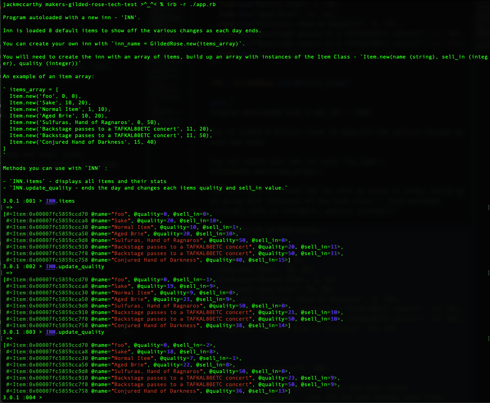
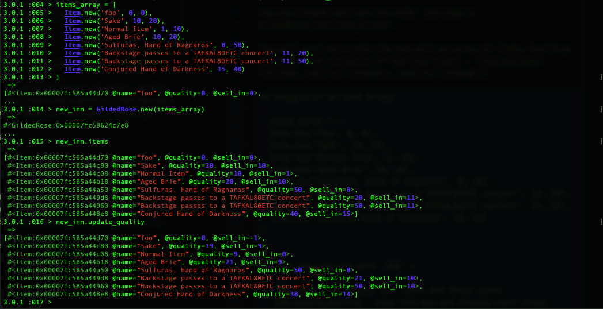

# makers-gilded-rose-tech-test

## Makers Academy, Week 10, Tech Test Practice - Gilded Rose Tech Test

## To Use
- git clone the repo to your machine
- run in command line: `bundle install`
- to run tests, enter in command line: `bundle exec rspec`
- to check linter, enter in command line: `rubocop`

**To use Program**
- run irb in your command line: `irb -r './app.rb'`
- Program autoloaded with a new inn - `INN`.

Methods you can use with `INN` :

- `INN.items` - displays all items and their stats
- `INN.update_quality - ends the day and changes each items quality and sell_in value.`

Create your own Inn:
- You can create your own inn with `inn_name = GildedRose.new(items_array)`.
- You will need to create the inn with an array of items, build up an array with instances of the Item Class before creating your own inn- `Item.new(name (string), sell_in (integer), quality (integer))`
  - An example of an item array:
    ` items_array = [
      Item.new('foo', 0, 0),
      Item.new('Sake', 10, 20),
      Item.new('Normal Item', 1, 10),
      Item.new('Aged Brie', 10, 20),
      Item.new('Sulfuras, Hand of Ragnaros', 0, 50),
      Item.new('Backstage passes to a TAFKAL80ETC concert', 11, 20),
      Item.new('Backstage passes to a TAFKAL80ETC concert', 11, 50),
      Item.new('Conjured Hand of Darkness', 15, 40)
    ]
    `

## Solution
This exercise was to refactor an existing code base to implement a new feature.

The existing code had no tests, so I developed a full suite of unit tests to confirm the working of the original code against the specification before I changed any code.

I then refactored the code to improve readability and pull out specific methods into private methods, to ensure each method was a) SRP and b) DRY. I used the tests to ensure the code continued to work as expected.

I also refactored in small chunks with lots of commits to ensure I could roll back on commits when necessary.

Finally once the code was refactored to my satisfaction, i developed unit tests for the new feature and TDD'd the new feature into existince.

I also added in attr_reader feature for the items, to be able to easily see what items where availabel in the shop and improve test readability.

## Code Structure & Dependencies
- Built with Ruby Version: 3.0.1

The code is developed around the one class GildedRose (which takes instances of the Item class on creation).

The class has a single main method - update_quality which iterates through each item and then adjusts the quality depending on the item.

The class has very seperated private methods, so that the behaviour of each type of item is kept seperate from each other and thus can be changed more easily and understood very easily.

#### Key Gems
- Testing: RSPEC
- Coverage: SimpleCov
- Linting: Rubocop

## Improvement Ideas
If I had more time I would probably implement:
- refactor GildedRose class into two classes
- a new feature to be able to add and remove items from the shop.
- Including an auto-removal for items at quality 0.
- add a terminal interface.

## Concerns
Main concern is that as this is an IRB program, is the user can access all the classes and disrupt the routing of the program. Therefore more error catching development would probably be needed or a command line interface to narrow down the possible user entry errors.

I would also like to work on the automated feature test a bit further in order to make it more readable. But I also tried out chaining expectations which was new for me.
